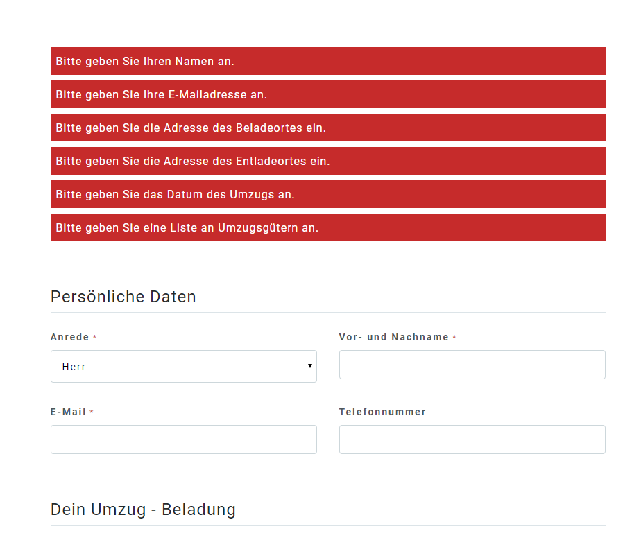

# Vivalidator

> A simple and easy input and data validation library

## Why?

I dislike the way of using Wordpress Plugins or heavy PHP packages for form development when it comes to Wordpress forms. I hate when third party code adds markup to your page or narrows my possibilites because of some restrictions coming with the external code. Thats why I started looking for easy to use validation frameworks but didn't find anything that perfectly fits my needs. This is why I started development on Vivalidator.

## Installation

#### The Composer Way

Run `composer require bdbch/vivalidator` in your project folder to install Vivalidator via Composer. It will be automatically placed into your autoload.

#### Manual Way

Make sure to have all necessary files copied manually into your project. Require the desired library from the `src` folder in your code to get access to a Vivalidator Class.

## Usage

Using the Validator is simple. Check out this example code to get an idea on how to use this feature.

```php
<?php

// Make sure to use the feature in your component
use Vivalidator\Validator;

// Data to validate. I left the job empty on purpose to demonstrate non-valid data
$data = [
  'name' => 'Peter',
  'age' => '23',
  'job' => ''
];

// Validator Options / Rules
// Each field can have multiple rules with their own error messages
$options = [
  'name' => [
    [
      'rule' => 'required',
      'error' => 'Please enter your name'
    ],
    [
      'rule' => 'minlength',
      'value' => 3,
      'error' => 'Your name needs to be longer than 3 characters.'
    ]
  ],
  'age' => [
    [
      'rule' => 'required',
      'error' => 'Please enter your age'
    ],
    [
      'rule' => 'min',
      'value' => 1,
      'error' => 'You need to be older than 1'
    ],
    [
      'rule' => 'max',
      'value' => 150,
      'error' => 'I would love to believe you, but I will not'
    ]
  ],
  'job' => [
    [
      'rule' => 'required',
      'error' => 'Please specify your job'
    ]
  ]
];

// Create a new validator instance and pass data and options in
$validator = new Validator($data, $options);

// Errors will be collected in an array.
// If there are no errors, it will be an empty string
if (count($validator->errors)) {
  echo 'You have ' . count($validator->errors) . ' errors in your submission.';
  foreach ($validator->errors as $error) {
    echo 'Error: ' . $error;
  }
} else {
  echo 'All set, lets submit!';
}

// Thats it
// You can now do what ever you want with the submitted data
// Make sure to escape the data. The validator doesn't do this right now
// TODO: This will be a feature so fields can be escaped if needed
```

## Adding ReCaptcha

Vivalidator now has ReCaptcha Support! Just specify your Secret Key and the Error String as extra data to configure it right away! Make sure to have the ReCaptcha library installed manually or via `composer require google/recaptcha`.

```php
// Check this URL if you need a Key
// https://www.google.com/recaptcha/admin
// Make sure you have a working ReCaptcha library installed,
// otherwise this will do nothing
$validator = new Validator($data, $options, [
  'recaptcha' => [
    'secret' => 'YOUR_SECRET_KEY_HERE',
    'error' => 'Please verify our captcha'
  ]
]);
```

## Rules

* `required` - Checks if the input is not empty
* `minlength` - Checks if the input is longer than a specific value
* `maxlength` - Checks if the input is lower than a specific value
* `email` - Checks if the input is a valid email
* `url` - Checks if the input is an URL
* `number` - Checks if the input is a number
* `min` - Checks if the input is higher than the defined value
* `max` - Checks if the input is lower than the defined value
* `between` - Checks if the input is between two numbers (combination of max and min)
* `regex` - Checks if the input matches a specified regex

#### Planned Rules
See [this issue](https://github.com/bdbch/flynt-validator/issues/1) to learn more

## Contribution

I'm open for pull requests and would love to see some support. I'm not the 100% best PHP developer and would love to get this Flynt feature even better so we're not bound to damn Wordpress Plugins anymore.

## License

This is licensed under the MIT license.
